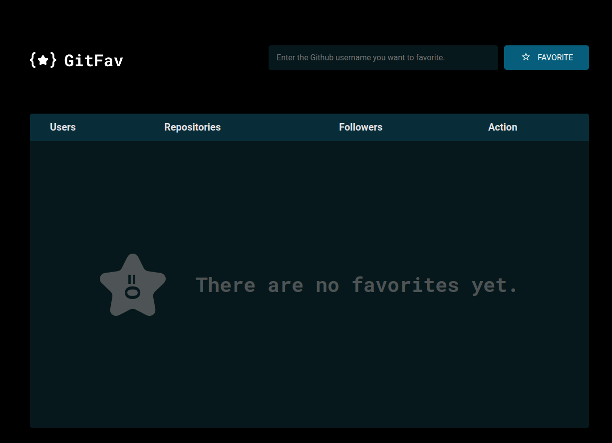
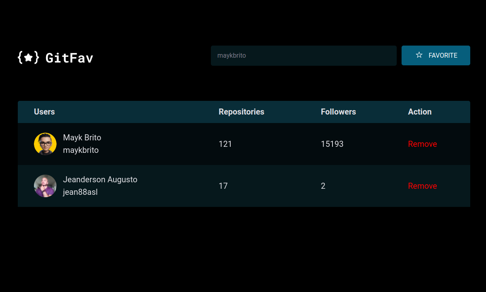

# GitHub Fav

GitFav é uma aplicação onde é possível adicionar ou remover seus usuários favoritos do GitHub e acessar o perfil dos favoritos clicando no nome/username. Todas as informações dos perfis, como o name, user, repositories e followers, são carregadas após efetuar uma busca dos dados na API do GitHub. Outro ponto interessante é que essas informações ficam salvas no navegador, assim quando usuário carrega novamente o site os dados continuam acessíveis, legal né!?

Primeira página:

  

Segunda página:

  

Esse projeto foi desenvolvido com as seguintes tecnologias:

- HTML e CSS
- API - GitHub
- JavaScript
- Git e Github
- Figma

